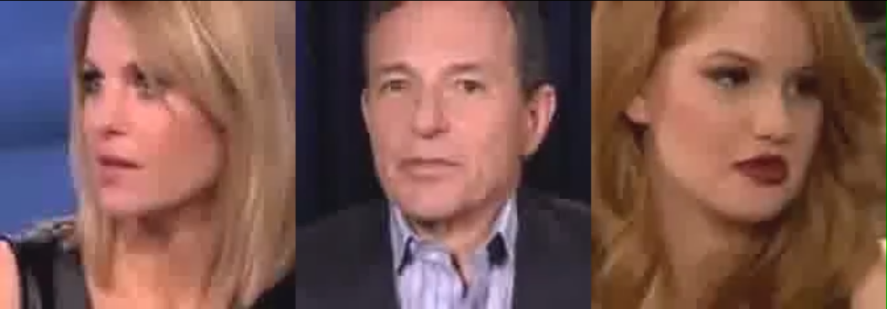

# Video-Audio Signal Processing
<!-- 
This is my implemention of the course project for **_Introduction to Auditory-visual Information System_**. -->
This repository contains three algorithms that solve the following problems respectively:

1. Recognize faces from videos clips.
2. Recongizes voices from audios.
3. Separate speeches from a videos of three speakers speaking together based on given visual and audio information of the speakers.

<div align=center></div>

This project is implemented in Python with the following packages: [Face Recognition](https://github.com/ageitgey/face_recognition), [Resemblyzer](https://github.com/resemble-ai/Resemblyzer), [Speechbrain](https://github.com/speechbrain/speechbrain).

# Run the code
Clone this project:
```zsh
git clone https://github.com/Lukeli0425/VASP.git
```
Install the required packages:
```zsh
pip install -r requirements.txt
```